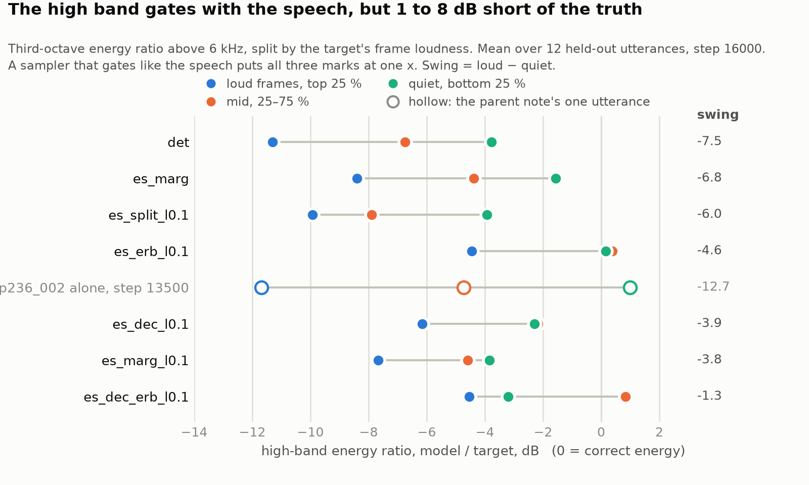

# Gated high-band deficit, all seven arms — `OV3_fast`, step 16000

**Date:** 2026-09-17. **Data:** 12 held-out utterances, the first two cached FLACs of p236 p237 p238 p360 p361 p374. **Draw:** τ = 1, seed 0 (`det`: τ = 0). **Noiseless:** τ = 0. **Naive:** `resample_poly(resample_poly(y, 1, 4), 4, 1)`. Frames are split by the target's frame energy in the evaluation STFT (n_fft 1024, hop 256): loud = top 25 %, mid = 25–75 %, quiet = bottom 25 %. The deficit is the mean over third-octave bands from 6 to 24 kHz of 10 log10(model / target energy). Swing = loud − quiet. Tables give the mean over utterances with the sd in parentheses; paired differences give mean ± SE over the same 12 utterances.

**Reproduce:** `audit/gated_arms.py` → `lisa_rtm_cache/results/gated_OV3_fast.json`; `audit/gated_arms_report.py` → this note and the figure. Extends [`../2026-09-17-snr-ceiling-gating-and-scale.md`](../2026-09-17-snr-ceiling-gating-and-scale.md) §2.1, which had one arm, one utterance, step 13500.

## 1. Deficit, gated deficit and SNR

| arm | deficit draw | deficit τ=0 | loud | mid | quiet | swing | SNR draw | SNR naive |
|---|---:|---:|---:|---:|---:|---:|---:|---:|
| det | -10.45 (4.1) | -10.45 (4.1) | -11.30 (4.2) | -6.75 (3.3) | -3.77 (2.2) | -7.53 (4.7) | +16.58 (3.0) | +16.86 (3.1) |
| es_marg | -7.77 (4.1) | -10.44 (4.5) | -8.41 (4.4) | -4.39 (3.4) | -1.56 (2.1) | -6.85 (5.4) | +15.90 (2.7) | +16.86 (3.1) |
| es_marg_l0.1 | -7.13 (4.5) | -9.98 (4.4) | -7.67 (4.9) | -4.59 (3.8) | -3.84 (1.8) | -3.83 (5.7) | +15.01 (2.6) | +16.86 (3.1) |
| es_split_l0.1 | -9.41 (4.9) | -9.28 (4.9) | -9.93 (5.5) | -7.90 (3.8) | -3.93 (2.1) | -6.01 (6.2) | +15.85 (2.9) | +16.86 (3.1) |
| es_erb_l0.1 | -3.54 (4.1) | -16.29 (4.2) | -4.45 (4.2) | +0.38 (3.4) | +0.16 (3.3) | -4.60 (5.9) | +13.00 (2.4) | +16.86 (3.1) |
| es_dec_l0.1 | -5.49 (4.2) | -13.25 (5.2) | -6.15 (4.5) | -2.18 (3.3) | -2.30 (3.2) | -3.85 (6.3) | +15.09 (2.5) | +16.86 (3.1) |
| es_dec_erb_l0.1 | -3.44 (4.3) | -15.33 (4.8) | -4.53 (4.5) | +0.83 (3.4) | -3.20 (2.6) | -1.33 (5.8) | +14.14 (2.3) | +16.86 (3.1) |

All in dB. Naive is the same 12 utterances, so its column repeats. SNR is maximised by doing nothing (§1 of the parent note); it is here beside naive and ranks nothing.

### 1.1 How far the high band rises from the quiet quarter of frames to the loud quarter

Loud and quiet hold the same number of frames, so swing = model rise − target rise, and the gating fraction is model / target. 1.00 gates like the speech; 0 is a flat high band.

| arm | target rise, dB | model rise, draw | model rise, τ=0 | gating fraction |
|---|---:|---:|---:|---:|
| det | +32.80 (6.12) | +25.28 (4.09) | +25.28 (4.09) | 0.79 (0.13) |
| es_marg | +32.80 (6.12) | +25.96 (4.52) | +35.02 (5.94) | 0.81 (0.16) |
| es_marg_l0.1 | +32.80 (6.12) | +28.97 (5.01) | +31.89 (5.77) | 0.91 (0.19) |
| es_split_l0.1 | +32.80 (6.12) | +26.80 (5.96) | +30.00 (5.74) | 0.83 (0.18) |
| es_erb_l0.1 | +32.80 (6.12) | +28.20 (4.04) | +25.11 (5.97) | 0.88 (0.19) |
| es_dec_l0.1 | +32.80 (6.12) | +28.95 (4.99) | +30.86 (6.93) | 0.91 (0.21) |
| es_dec_erb_l0.1 | +32.80 (6.12) | +31.48 (4.81) | +25.73 (6.41) | 0.98 (0.20) |

### 1.2 Paired differences, first minus second, over the same utterances

| pair | deficit | loud | quiet | swing | SNR |
|---|---:|---:|---:|---:|---:|
| ERB term: `es_erb_l0.1` − `es_marg_l0.1` | +3.6 ± 0.3 (12+/0−) | +3.2 ± 0.4 (12+/0−) | +4.0 ± 0.7 (12+/0−) | -0.8 ± 0.9 (5+/7−) | -2.0 ± 0.3 (0+/12−) |
| decoder noise: `es_dec_l0.1` − `es_marg_l0.1` | +1.6 ± 0.2 (12+/0−) | +1.5 ± 0.3 (12+/0−) | +1.5 ± 0.7 (9+/3−) | -0.0 ± 0.8 (7+/5−) | +0.1 ± 0.1 (8+/4−) |
| decoder noise on ERB: `es_dec_erb_l0.1` − `es_erb_l0.1` | +0.1 ± 0.2 (4+/8−) | -0.1 ± 0.3 (4+/8−) | -3.4 ± 0.7 (0+/12−) | +3.3 ± 0.7 (11+/1−) | +1.1 ± 0.3 (11+/1−) |
| ERB term on decoder noise: `es_dec_erb_l0.1` − `es_dec_l0.1` | +2.0 ± 0.3 (12+/0−) | +1.6 ± 0.3 (12+/0−) | -0.9 ± 0.6 (5+/7−) | +2.5 ± 0.6 (11+/1−) | -0.9 ± 0.2 (0+/12−) |
| low-band waveform term: `es_split_l0.1` − `es_marg_l0.1` | -2.3 ± 0.4 (0+/12−) | -2.3 ± 0.4 (0+/12−) | -0.1 ± 0.3 (6+/6−) | -2.2 ± 0.5 (1+/11−) | +0.8 ± 0.2 (12+/0−) |
| λ 0.1 vs 0.01: `es_marg_l0.1` − `es_marg` | +0.6 ± 0.3 (10+/2−) | +0.7 ± 0.3 (11+/1−) | -2.3 ± 0.3 (0+/12−) | +3.0 ± 0.5 (11+/1−) | -0.9 ± 0.2 (0+/12−) |
| sampler vs point: `es_marg` − `det` | +2.7 ± 0.2 (12+/0−) | +2.9 ± 0.2 (12+/0−) | +2.2 ± 0.3 (12+/0−) | +0.7 ± 0.3 (10+/2−) | -0.7 ± 0.1 (0+/12−) |
| best vs point: `es_dec_erb_l0.1` − `det` | +7.0 ± 0.4 (12+/0−) | +6.8 ± 0.4 (12+/0−) | +0.6 ± 0.4 (5+/7−) | +6.2 ± 0.6 (12+/0−) | -2.4 ± 0.4 (0+/12−) |

dB, mean ± SE, and the sign count over 12 utterances.

## 2. Per-band ratio of the draw

| arm | 6735 Hz | 8485 Hz | 10691 Hz | 13470 Hz | 16971 Hz | 21382 Hz |
|---|---:|---:|---:|---:|---:|---:|
| det | -7.16 (1.5) | -16.74 (4.5) | -11.35 (6.7) | -12.63 (5.6) | -8.55 (5.0) | -6.29 (4.1) |
| es_marg | -6.05 (2.7) | -13.51 (4.4) | -8.20 (6.3) | -8.72 (5.4) | -9.04 (5.4) | -1.14 (4.8) |
| es_marg_l0.1 | -1.46 (1.4) | -9.74 (4.9) | -7.98 (7.0) | -7.24 (6.3) | -8.63 (5.7) | -7.76 (4.4) |
| es_split_l0.1 | -0.82 (1.5) | -12.16 (5.3) | -10.26 (7.3) | -10.86 (7.1) | -13.09 (6.3) | -9.29 (4.6) |
| es_erb_l0.1 | +0.69 (2.2) | -6.79 (4.4) | -4.99 (6.5) | -3.82 (5.7) | -3.98 (5.2) | -2.34 (4.2) |
| es_dec_l0.1 | -1.37 (1.7) | -8.07 (4.5) | -6.13 (6.3) | -4.83 (5.8) | -6.69 (5.4) | -5.86 (4.3) |
| es_dec_erb_l0.1 | -0.38 (2.0) | -7.42 (4.7) | -5.18 (6.8) | -3.76 (6.0) | -3.58 (4.9) | -0.35 (4.2) |

Third-octave centre frequencies; dB, mean (sd) over utterances. The τ = 0 pass per band is in the JSON.

## 3. Figure

*Arms ordered by swing, worst at the top. Filled marks: mean over 12 utterances at step 16000. Hollow rings: the parent note's numbers, `es_erb_l0.1` on p236_002 alone at step 13500. The column at the right is the swing.*

## 4. Does the note hold?

| `es_erb_l0.1` on p236_002 | deficit | loud | mid | quiet | swing | SNR |
|---|---:|---:|---:|---:|---:|---:|
| note, step 13500 | -10.87 | -11.68 | -4.73 | +0.99 | -12.67 | 13.88 |
| same utterance, step 16000 | -10.95 | -11.75 | -4.88 | +0.58 | -12.34 | 13.90 |
| mean of 12, step 16000 | -3.54 | -4.45 | +0.38 | +0.16 | -4.60 | 13.00 |

Per band, the note's draw on p236_002 was -1.79 / -16.28 / -14.22 / -10.08 / -13.50 / -9.34; step 16000 gives -1.99 / -16.40 / -14.26 / -10.14 / -13.56 / -9.34. Same to 0.2 dB.

## 5. What it shows

Every arm gates, and every arm gates short. The target's high band rises 32.8 dB from the quiet quarter of frames to the loud quarter; the seven models rise 25.3 to 31.5 dB, a gating fraction of 0.79 to 0.98, so the note's "roughly constant level under the voice" is wrong as written: on p236_002 the band rises 25 dB, and the swing is the 12 dB it falls short. `det` gates worst at -7.5 dB and `es_dec_erb_l0.1` best at -1.3, a paired +6.2 ± 0.6 dB on 12 of 12 utterances; between them `es_marg` -6.8, `es_split_l0.1` -6.0, `es_erb_l0.1` -4.6, `es_dec_l0.1` -3.9, `es_marg_l0.1` -3.8. The ERB term fixes the level and not the gating: against `es_marg_l0.1` it lifts the deficit +3.6 ± 0.3 dB, the loud frames +3.2 ± 0.4 and the quiet frames +4.0 ± 0.7, each on all 12 utterances, and moves the swing -0.8 ± 0.9, which is nothing. It lands the quiet frames at +0.16 dB, the only arm with mid and quiet above zero, and that is the hiss: the right energy on average, in the gaps as much as on the fricatives, for 2.0 dB of SNR. Decoder noise alone is the same story at a third the size, deficit +1.6 ± 0.2 dB and swing -0.0 ± 0.8. Decoder noise on top of the ERB term is the one change that moves the swing: `es_dec_erb_l0.1` against `es_erb_l0.1` leaves the loud frames at -0.1 ± 0.3 dB, drops the quiet frames -3.4 ± 0.7 dB on 12 of 12, closes the swing by +3.3 ± 0.7, and gives back 1.1 dB of SNR. The note's numbers hold on their own utterance: `es_erb_l0.1` on p236_002 at step 16000 is -11.75 / -4.88 / +0.58 against -11.68 / -4.73 / +0.99, within 0.5 dB after 2500 more steps, and the per-band shape matches to 0.2 dB. They do not hold as a summary: p236_002 is the worst of the twelve for that arm because its target high band rises 37.3 dB from quiet to loud, the swing tracks that rise at r = -0.78, the twelve-utterance mean is -4.45 / +0.38 / +0.16 with a swing of -4.6 dB rather than 12.7, and 3 utterances swing the other way. The inverted spectral balance is general: the 8485 Hz band, where the target has the most energy, is the worst band for 6 of the seven arms (`es_split_l0.1` bottoms out at 16971 Hz), and the band just above the cut is within 1.5 dB for every arm trained at λ = 0.1. The mean deficit still hides all of this: `es_erb_l0.1` and `es_dec_erb_l0.1` sit 0.1 dB apart on the deficit and 3.3 dB apart on the swing. Last, the τ = 0 column says where the band comes from: `es_split_l0.1`'s draw and noiseless pass agree to 0.1 dB, so its noise adds no high-band energy, while the ERB arms' noiseless pass sits 12 to 13 dB below their draw.
